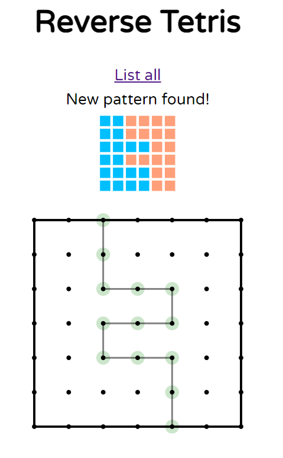
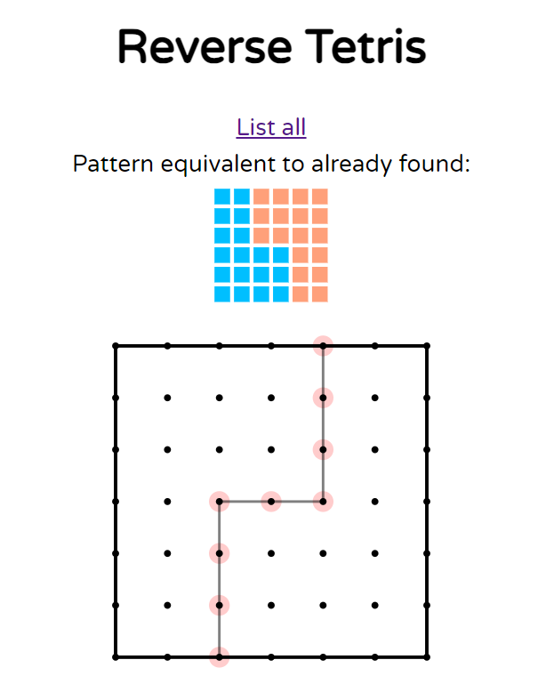
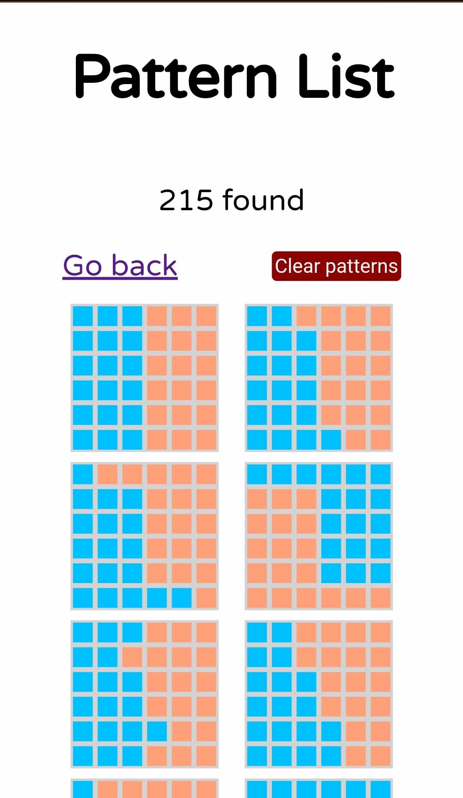

# Reverse Tetris
`Author: Kacper Grzymkowski`

[Application link](https://niegrzybkowski.github.io/reverse-tetris/)

A simple Pen&Paper game adapted to the web.
Divide a grid into 2 rotationally symmetric parts and track which arrangements you already found. 
In a 6x6 grid there are theoretically 255 allowed combinations. 
However, I have not tested this and it might be a possibility that something is broken and some might be missing.
The app uses localstorage to track progress and I might add a database storage sometime in the future, as well as different grid sizes.

Inspired by [VSauce video (youtube.com)](https://www.youtube.com/watch?v=VXLriB4hQ0U). 
Using adapted pattern lock code from [Tympanix/pattern-lock-js](https://github.com/Tympanix/pattern-lock-js).

## Screenshots

